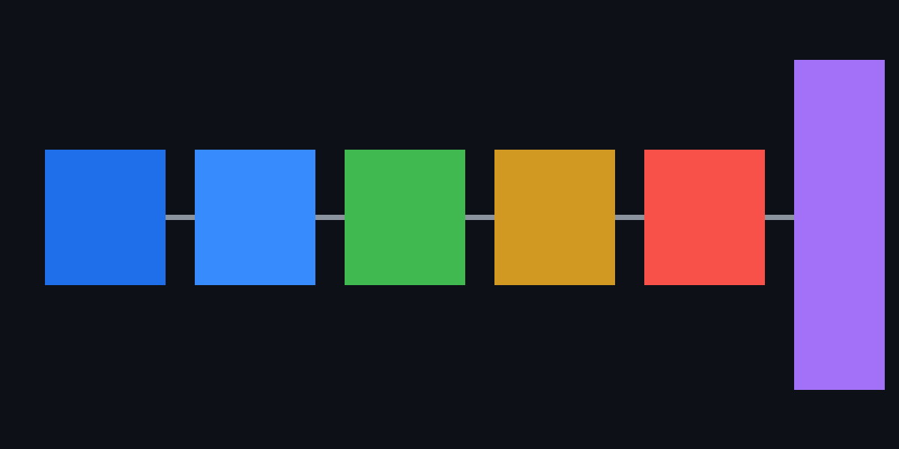

# DevSecOps CloudFormation Pipeline PoC

This project demonstrates a CloudFormation-based DevSecOps pipeline that secures the delivery process from code commit to AWS/EKS deployment. It combines GitHub Actions security gates, secret scanning, SAST, SCA, IaC validation, container scanning, Kubernetes security controls, and runtime observability with Prometheus and Grafana.

---

## Table of Contents

- [Project Overview](#project-overview)
- [Pipeline Diagram](#pipeline-diagram)
- [Pipeline Overview](#pipeline-overview)
- [Security Controls Demonstrated](#security-controls-demonstrated)
- [AWS Architecture](#aws-architecture)
- [Kubernetes Security](#kubernetes-security)
- [Observability with Prometheus and Grafana](#observability-with-prometheus-and-grafana)
- [Local Development](#local-development)
- [Security Scanning Commands](#security-scanning-commands)
- [GitHub Actions Pipeline](#github-actions-pipeline)

---

## Project Overview

This project demonstrates a complete DevSecOps pipeline for a containerised, cloud-native web application. Security is embedded at every stage of the software delivery lifecycle — from the developer workstation through automated CI/CD gates to a hardened Kubernetes deployment on AWS.

The application is a three-tier web service: an nginx frontend, a Python/Flask backend, and an observability stack using Prometheus and Grafana. The infrastructure and pipeline are the focus of this project, not the application itself.

**CloudFormation was chosen deliberately** because it is the infrastructure-as-code tool used in the target environment. This project demonstrates the ability to work with CloudFormation alongside modern DevSecOps tooling.

**GitHub Actions OIDC** is used instead of long-lived AWS access keys. The workflow exchanges a short-lived GitHub token for temporary AWS credentials, meaning no AWS secrets are stored in GitHub.

**Key technologies:** GitHub Actions · AWS EKS · AWS CloudFormation · Amazon ECR · AWS Secrets Manager · Docker · Kubernetes · Prometheus · Grafana · Gitleaks · Trivy · Semgrep · Checkov · OWASP ZAP

---

## Pipeline Diagram



---

## Pipeline Overview

Every push to `main` triggers the following automated security gates in sequence:

```
Developer Workstation
  └── .gitignore                        Prevent secrets from being staged
  └── Pre-commit hook                   Block commits with secrets or lint errors
  └── Gitleaks (local)                  Scan staged files for secrets before commit

GitHub Pull Request / Push
  └── Gitleaks (GitHub Actions)         Full repo and history secret scan
  └── pytest                            Unit tests must pass before scans proceed
  └── Bandit                            Python SAST — static analysis for security bugs
  └── pip-audit                         SCA — Python dependency CVE scanning
  └── Semgrep                           Multi-language SAST with security rulesets
  └── cfn-lint                          CloudFormation template validation
  └── Checkov                           IaC and Kubernetes manifest policy scanning
  └── Docker build (backend + frontend) Build hardened, minimal container images
  └── Trivy                             Container image CVE scan — blocks CRITICAL/HIGH
  └── OWASP ZAP (PR only)              DAST baseline scan against the running application

On Push to main (CD Gate)
  └── GitHub Actions OIDC               Authenticate to AWS — no long-lived keys stored
  └── Amazon ECR                        Push scanned, tagged images to private registry
  └── AWS CloudFormation                Provision and update infrastructure declaratively
  └── AWS Secrets Manager               Inject secrets at runtime — never in code
  └── Amazon EKS                        Deploy with RBAC, NetworkPolicy, and Ingress
  └── Prometheus + Grafana              Observability — metrics scraping and dashboards
```

No stage proceeds if an earlier gate fails. The deploy job never runs on pull requests.

---

## Security Controls Demonstrated

| Tool / Control | Category | Purpose |
|---|---|---|
| `.gitignore` | Secrets hygiene | Prevent `.env` files, keys, and credentials from being staged |
| Pre-commit hook | Shift-left | Block commits containing secrets before they reach the remote |
| Gitleaks | Secret scanning | Detect secrets in staged files and full repository history |
| Branch protection rules | Access control | Require passing CI checks and reviewer approval before merge to `main` |
| CODEOWNERS | Access control | Enforce designated reviewers per file or directory |
| Dependabot | Supply chain | Automated PRs for outdated Actions, Python packages, and Docker base images |
| RBAC / minimal GitHub Actions permissions | Access control | Minimal workflow permissions — `contents: read`, `id-token: write` only where required |
| Mandatory reviews | Process control | Pull requests require human approval before merge |
| pytest | Testing | Unit tests run first — no security scan proceeds on a broken build |
| Bandit | SAST | Python-specific static analysis for common security vulnerabilities |
| Semgrep | SAST | Multi-language static analysis with OWASP and security-focused rulesets |
| pip-audit | SCA | CVE scanning of Python dependencies against OSV and PyPI advisories |
| cfn-lint | IaC validation | CloudFormation template syntax and AWS best-practice checks |
| Checkov | IaC / policy scan | Policy-as-code checks for CloudFormation, Kubernetes manifests, and Dockerfiles |
| Docker build | Container | Reproducible, minimal images built with non-root users |
| Trivy | Image scanning | CVE scan of built images — pipeline fails on unresolved CRITICAL or HIGH findings |
| OWASP ZAP | DAST | Baseline scan of the live application against OWASP Top 10 attack patterns |
| GitHub Actions OIDC | Authentication | Short-lived AWS credentials via OIDC — no stored access keys anywhere |
| Amazon ECR | Registry | Private, access-controlled image registry |
| AWS CloudFormation | IaC | Declarative, auditable, version-controlled infrastructure provisioning |
| AWS Secrets Manager | Secrets management | Runtime secret injection — secrets never appear in code, images, or CI logs |
| EKS RBAC | K8s access control | Least-privilege ServiceAccounts and Role bindings per workload |
| Kubernetes NetworkPolicy | Network control | Default-deny with explicit allow rules between services only |
| Pod Security Context | Container hardening | Non-root user, read-only root filesystem, no privilege escalation, capabilities dropped |
| Prometheus | Observability | Application metrics scraping and runtime visibility after deployment |
| Grafana | Observability | Metrics dashboards for request rate, error rate, and latency |

---

## AWS Architecture

```
┌──────────────────────────────────────────────────────┐
│                  GitHub Actions                        │
│  CI: scan → test → build → push                      │
│  CD: OIDC auth → ECR push → EKS deploy                 │
└──────────────────────┬───────────────────────────────┘
                       │ OIDC (no long-lived keys)
                       ▼
┌─────────────────────────────────────────────────────┐
│                      AWS                             │
│                                                      │
│  ┌──────────┐  ┌──────────────┐  ┌──────────────┐  │
│  │   ECR    │  │CloudFormation│  │   Secrets     │  │
│  │ (images) │  │  (infra IaC)  │   Manager   │  │
│  └──────────┘  └──────────────┘  └──────────────┘  │
│                                                      │
│  ┌─────────────────────────────────────────────┐   │
│  │             Amazon EKS Cluster               │   │
│  │                                              │   │
│  │  ┌──────────┐  ┌──────────┐  ┌──────────┐  │   │
│  │  │ Frontend │  │ Backend  │  │Prometheus│  │   │
│  │  │  (nginx) │  │ (Flask)  │  │+ Grafana │  │   │
│  │  └──────────┘  └──────────┘  └──────────┘  │   │
│  │  NetworkPolicy · RBAC · Non-root pods        │   │
│  └──────────────────────────────────────────────┘   │
└──────────────────────────────────────────────────────┘
```

**CloudFormation** provisions IAM roles, ECR repositories, S3 artifact bucket, and the GitHub Actions OIDC provider as auditable, version-controlled infrastructure.

**GitHub Actions OIDC** eliminates long-lived AWS credentials. The workflow exchanges a short-lived GitHub token for temporary AWS credentials scoped to only the permissions needed for deployment.

**AWS Secrets Manager** stores application secrets. The EKS deployment injects them at runtime via Kubernetes Secrets, keeping them out of source code, Docker images, and environment files.

---

## Kubernetes Security

The EKS deployment applies multiple layers of Kubernetes-native security controls:

**RBAC** — A dedicated `ServiceAccount` is bound to a minimal `Role` granting only the permissions the application needs. The default service account token is disabled (`automountServiceAccountToken: false`).

**NetworkPolicy** — A default-deny policy blocks all ingress and egress by default. Explicit allow rules permit only the required traffic paths: frontend → backend, and Prometheus → backend scrape endpoint.

**Pod Security Context** — Every pod runs with:
- `runAsNonRoot: true` with an explicit numeric `runAsUser`
- `readOnlyRootFilesystem: true` — writable paths use `emptyDir` volumes
- `allowPrivilegeEscalation: false`
- All Linux capabilities dropped: `capabilities.drop: ["ALL"]`
- `seccompProfile: RuntimeDefault`

**Ingress** — Traffic enters through a Kubernetes Ingress resource, centralising routing and enabling TLS termination without exposing services directly.

---

## Observability with Prometheus and Grafana

Prometheus and Grafana provide runtime visibility after every deployment — security does not stop at the pipeline gate.

**Prometheus** scrapes application metrics from the backend `/metrics` endpoint, exposed via `prometheus_flask_exporter`. Pod annotations (`prometheus.io/scrape`, `prometheus.io/path`, `prometheus.io/port`) tell Prometheus which pods to scrape automatically without manual configuration.

**Grafana** connects to Prometheus as a data source and provides dashboards for request rate, error rate, and latency. Grafana credentials are injected from environment variables at runtime — never hardcoded.

Metrics are visible immediately after deployment, enabling detection of anomalous behaviour and performance regressions alongside security events.

To access locally:

```bash
docker compose up -d
# Prometheus: http://localhost:9090
# Grafana:    http://localhost:3001  (credentials from .env)
```

---

## Local Development

**Prerequisites:** Docker, Docker Compose, Python 3.12+

```bash
# Clone the repository
git clone https://github.com/nanado002/devsecops-cloudformation-poc.git
cd devsecops-cloudformation-poc

# Set up environment variables
cp .env.example .env
# Edit .env and fill in required values

# Build and start all services
docker compose up --build

# Run backend unit tests
pip install -r app/backend/requirements.txt pytest
pytest tests/ -v

# Tear down all containers and volumes
docker compose down -v
```

| Service | Local URL |
|---|---|
| Frontend (nginx) | http://localhost:8080 |
| Backend (Flask) | http://localhost:5000 |
| Prometheus | http://localhost:9090 |
| Grafana | http://localhost:3001 |

---

## Security Scanning Commands

These reproduce what the CI pipeline runs automatically:

```bash
# Secret scanning — full repository history
gitleaks detect --source . --redact --no-git

# Python SAST
bandit -r app/backend -ll

# Python dependency CVE scan
pip-audit -r app/backend/requirements.txt

# Multi-language SAST
semgrep --config p/python --config p/docker --config p/github-actions .

# CloudFormation lint
cfn-lint cloudformation/*.yml

# IaC and Kubernetes policy scan
checkov -d . --quiet

# Container image CVE scan
docker build -t devsecops-poc-backend:local app/backend
trivy image --severity CRITICAL,HIGH --ignore-unfixed devsecops-poc-backend:local

# DAST baseline scan (requires running application)
docker compose up -d
docker run --network host \
  ghcr.io/zaproxy/zaproxy:stable \
  zap-baseline.py -t http://localhost:8080
```

---

## GitHub Actions Pipeline

The workflow (`.github/workflows/ci-devsecops.yml`) runs three jobs with strict dependency ordering:

**Security Gates and Build** — runs on every push and pull request

Gitleaks secret scan → pytest unit tests → Bandit SAST → pip-audit SCA → Semgrep SAST → cfn-lint → Checkov → Docker build (backend + frontend) → Trivy image scan

**DAST Baseline** — runs on pull requests only

Spins up the full application stack via Docker Compose → waits for all services to pass health checks → runs OWASP ZAP baseline scan → tears down

**Deploy to EKS** — runs on push to `main` only, after Security Gates passes

Authenticates to AWS via GitHub Actions OIDC → pushes images to Amazon ECR → updates kubeconfig → creates Kubernetes Secrets from AWS Secrets Manager values → applies namespace, RBAC, NetworkPolicy, and Deployment manifests → waits for rollout to complete → reports pod status

The deploy job never runs on pull requests. No stage proceeds if an earlier gate fails.

**EKS deployment is optional.** The deploy job only runs when the GitHub Actions repository variable `ENABLE_EKS_DEPLOY` is set to `true`. When the variable is absent or set to any other value, the job is skipped and the pipeline passes without attempting a cluster connection. This avoids unnecessary AWS cost when the PoC cluster is not provisioned.

If `ENABLE_EKS_DEPLOY=true` but the cluster does not exist, a preflight check exits cleanly with a message rather than failing. AWS authentication uses GitHub Actions OIDC — no long-lived credentials are stored.
